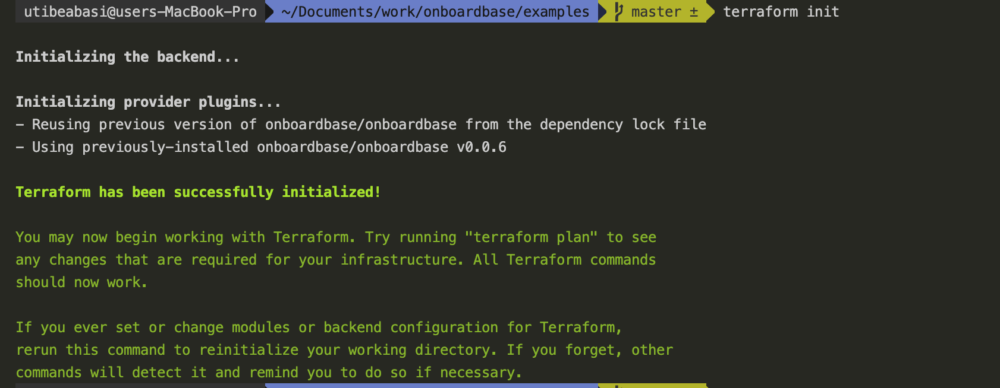
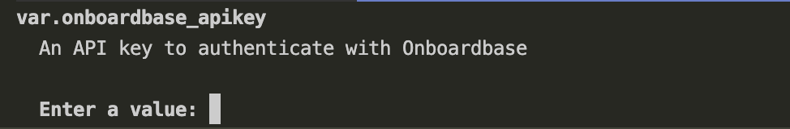
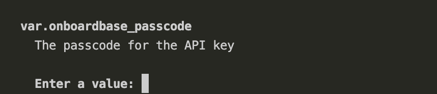
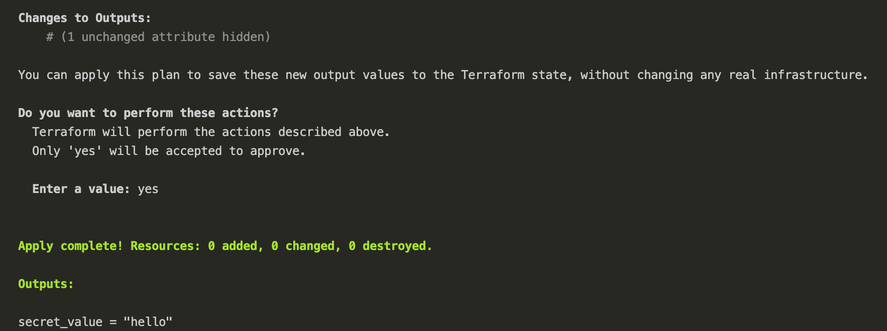

# Terraform Provider Onboardbase

## Provider Overview

The Onboardbase terraform provider allows you to fetch secrets stored on your Onboardbase account and use them in your Tertaform code

## Prerequisites

To follow along with this guide, you need to have the following set up

- An Onboardbase account with a project and environment created
- Experience with Terraform

## Fetching secrets with the `onboardbase_secret` data source

This examples shows how to fetch a secret stored on onboardbase for use in your Terraform code

In your Terraform block, point terraform to the Onboardbase provider as shown below.

```hcl

terraform {
  required_providers {
    onboardbase = {
      source = "Onboardbase/onboardbase"
    }
  }
}

```

Define variables to store your Onboardbase API key and passcode

```hcl

variable "onboardbase_apikey" {
  type = string
  description = "An API key to authenticate with Onboardbase"
}

variable "onboardbase_passcode" {
  type = string
  description = "The passcode for the API key"
}

```

Add an `onboardbase` provider block and pass in the API key and passcode the provider will use to authenticate with your onboardbase account.

```hcl

provider "onboardbase" {
  apikey = var.onboardbase_apikey // Your onboardbase API key
  passcode = var.onboardbase_passcode // Your passcode
}

```

Next create a data source of type `onboardbase_secret` and pass in the name of the secret you want to access, as well as the project and the environment where the secret is defined.

```hcl
data "onboardbase_secret" "example" {
  name = "name"
  project = "project"
  environment = "environment"
}

```

Finally, access the `secret` property of the data source which will be set to the value of the secret you want to access. Note that the provider returns the secret as a sensitive value so we need to explicitly mark it as nonsensitive in order to view it on the command line

```hcl
output "secret_value" {
  value = nonsensitive(data.onboardbase_secret.example.secret)
}

```

Now, Run `terraform init` to find download the latest version of the provider



For the purpose of this guide, we will be passing in our variables from the command line







And Voila! You have successfully used the Onboardbase terraform provider to securely pass in secrets from your onboardbase account.
